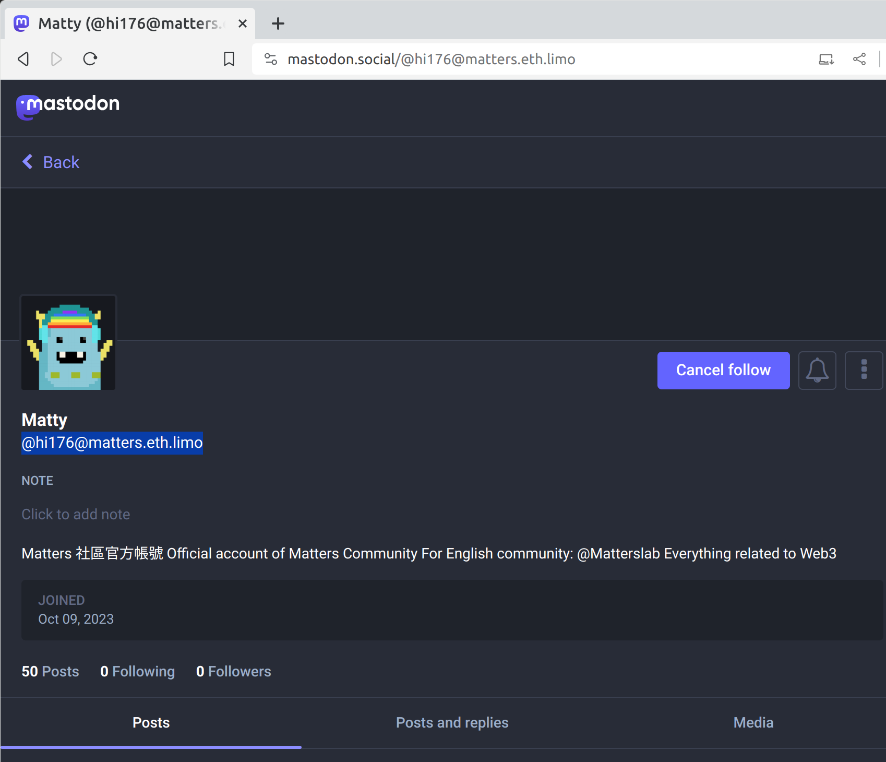

# Matters IPNS Site Generator

Matters IPNS Site Generator is currently used by matters.town, to genereate HTML files of article & user homepage & static activitypub files before adding to IPFS & IPNS.

It can be used to create encrypted HTML page with decryption code embedded, generate HTML bundle, and create content metadata.

## Installation

### NPM

```sh
npm install --save @matters/ipns-site-generator
```

## Usage

### Create HTML bundle for uploading to IPFS

`makeArticlePage` returns an array of object that contains path and buffer data that can be added with IPFS API directly. See [test](./src/__tests__/makeArticlePage.test.ts) for more detail.

```js
import { makeArticlePage } from '@matters/ipns-site-generator'

const article = {
  meta: { ... },
  byline: { ... },
  rss: { ... },
  article: { ... },
}

// this creates an array of object containing path and buffer data,
// which IPFS recognizes as a folder
const { bundle } = await makeArticlePage(article)
```

### Create an encrypted HTML

Pass in a HTML string as content, and return a HTML string with the content encrypted and the encrytion key. The returned HTML can be then written to a file or add to IPFS. During rendering, the HTML will be decrypted by adding `key=${encrytion-key}` in query parameter, and also include a simple UI to prompt key enter.

Support payment pointer for Web Monetization. See [test](./src/__tests__/makeArticlePage.test.ts) for more detail.

```js
import { makeArticlePage } from '@matters/ipns-site-generator'

const { bundle, key } = await makeArticlePage({
  encrypted: true, // argument for whether encrypt or not, if false returned key will be null
  paymentPointer: '$pay-me', // used for Web Monetization
  meta: { ... },
  byline: { ... },
  rss: { ... },
  article: { ... },
})
```

### Create HTML bundle for user homepage & static activitypub files
```js
import { 
  HomepageContext,
  makeHomepageBundles,
  makeActivityPubBundles,
} from '@matters/ipns-site-generator'

const context: HomepageContext = {
  meta: { title, description, authorName, siteDomain, image, ... },
  byline: { author: { userName, displayName, ipnsKey, webfDomain, }, ... },
  rss: { ... },
  articles: [ { id, title, createdAt, ... }, ... ],
}

const contents = [
  ...makeHomepageBundles(context),
  ...makeActivityPubBundles(context),
]

const bundles = await ipfs.addAll(contents) // get the top dir CID
```



## Unit test

Run test with:

```
npm run test
```

Tests were run with Jest after compiled to JavaScript. Most test are run with snapshots located in `src/__tests__/__snapshots__`.

Encryption with `formatHTML` changes in every run, since encryption is random, and we cannot use snapshot. Therefore the test write out a HTML file to `src/__tests__/__snapshots__` with decryption key as filename. You can open and test the decryption manually.
